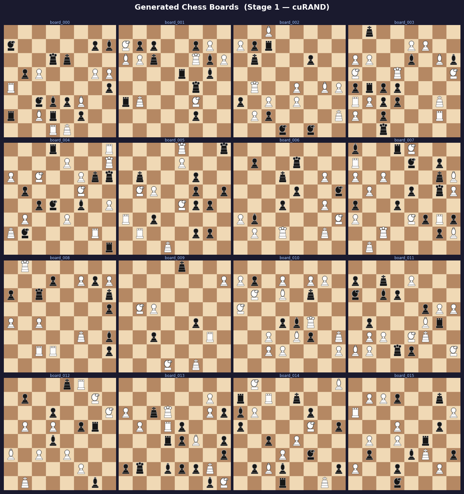
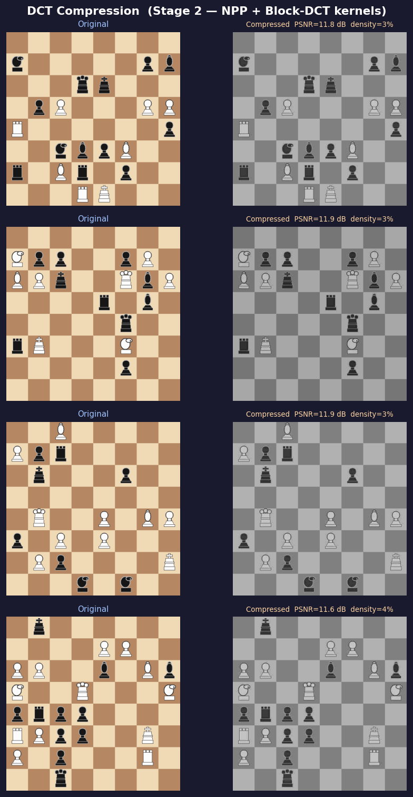
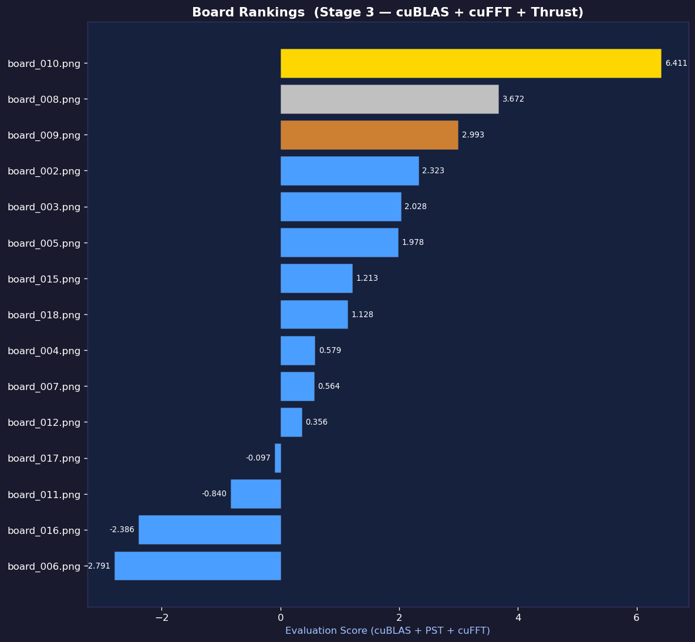
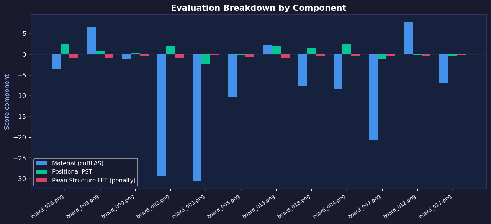

# CUDA Chess Vision

GPU-accelerated chess board generation, block-DCT compression, and position evaluation pipeline using four CUDA GPU libraries working together: **cuRAND**, **NPP**, **cuBLAS**, **cuFFT**, and **Thrust**.

---

## What it does

Runs a complete three-stage GPU pipeline without ever leaving device memory (except for final metric downloads):

**Stage 1 — Board Generation (cuRAND)**
Generates fully random, legal chess positions on the GPU in parallel. It handles piece placement, ensures kings are not adjacent, and renders the result as an uncompressed RGB pixel-art image directly in VRAM.

**Stage 2 — Block-DCT Compression (NPP + custom CUDA kernels)**
Takes the raw RGB frames, converts them to grayscale, and applies an 8x8 block Discrete Cosine Transform (DCT) using NPP. A custom kernel applies a JPEG-style quantization matrix, performing lossy compression and a parallel PSNR reduction.

**Stage 3 — Board Evaluation (cuBLAS + cuFFT + Thrust)**
Evaluates the visual states:
- **cuBLAS** (`cublasSgemm`) — Multiplies spatial features by constant Piece-Square Tables (PST) in a matrix multiplication to calculate positional scores.
- **cuFFT** (`cufftExecR2C`) — Runs a 1D FFT on pawn files to extract high-frequency structural energy.
- **Thrust** (`thrust::sort_by_key`) — Sorts all boards by their combined total score to rank the best positions.

---

## Project structure

```
cuda-chess-vision/
├── Makefile
├── run.sh
├── include/
│   ├── board_gen.h         # Stage 1: cuRAND generation
│   ├── compression.h       # Stage 2: NPP block-DCT
│   ├── evaluator.h         # Stage 3: cuBLAS/cuFFT/Thrust eval
│   └── image_io.h          # PNG I/O interface
├── src/
│   ├── main.cu             # Orchestrator
│   ├── board_gen.cu
│   ├── compression.cu
│   ├── evaluator.cu
│   ├── image_io.c
│   └── pipeline.cu         # (Deprecated old pipeline)
├── scripts/
│   └── visualize.py        # Generate matplotlib plots from results
├── plots/                  # Generated visualizations
└── results/                # Output images and CSVs
```

---

## Build & Run

```bash
make
make run          # Build and run (20 boards)
make run-large    # Build and run (100 boards)
make viz          # Generate plots from results
```

Or use the provided wrapper script:
```bash
./run.sh --large
```

---

## Visualisations & Results

After running the pipeline, `scripts/visualize.py` generates the following performance and analytical plots:

### Board Generation & Gallery


### DCT Compression Quality


### Board Evaluation Rankings


### Feature Breakdown


---

## Performance 

Execution metrics (NVIDIA RTX 4050 Laptop GPU):
- **Stage 1 (cuRAND)**: ~8.5 ms (for 20 boards) -> ~2300 boards/sec
- **Stage 2 (DCT)**: ~250 ms 
- **Stage 3 (Evaluation)**: ~130 ms

Total End-to-End Pipeline on GPU: **~400 ms** for full generation, compression, and analysis.

---

## Lessons Learned

- **Static vs Dynamic Linking**: Found a WSL-specific issue where dynamically linking `libcublas.so` can break the CUDA initialization state. Fixed by forcing static linkage (`-lcublas_static -lcublasLt_static -lculibos`) in the Makefile.
- **cuRAND**: Managing RNG states per-thread requires careful initialization memory handling to prevent state corruption.
- **NPP Block-DCT**: Utilizing NPP for transforms requires aligning inputs and padding memory effectively.
- **cuBLAS & cuFFT integration**: Keeping data resident in VRAM across libraries yields massive speedups, provided memory pointers align correctly to each library's expectations (e.g. column-major vs row-major mapping).

## License
MIT
